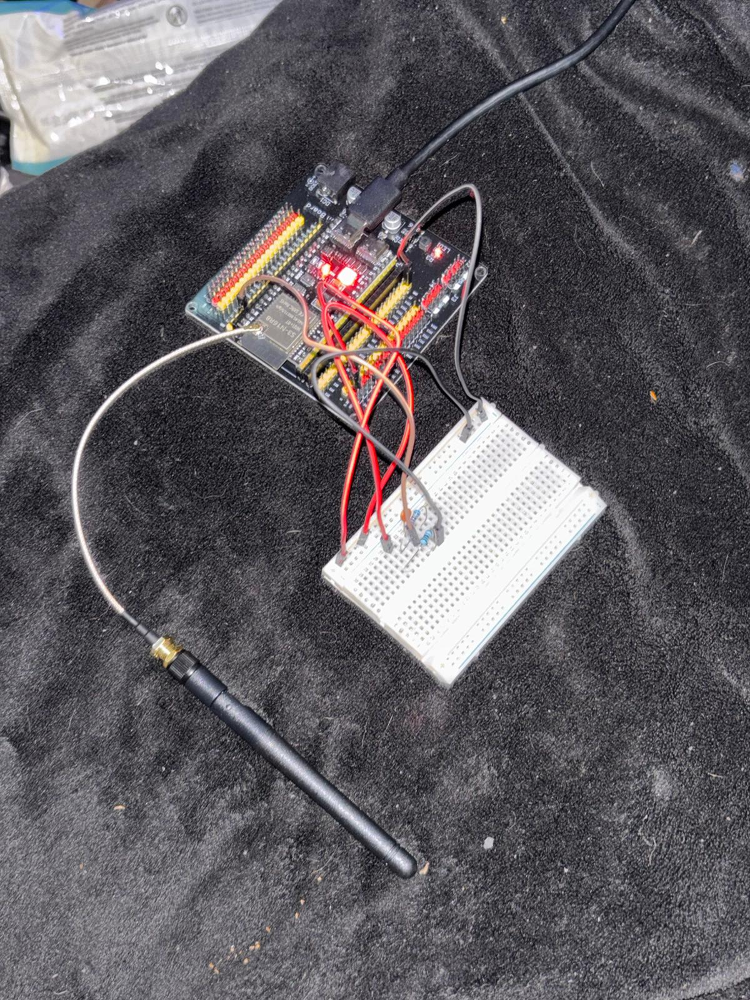
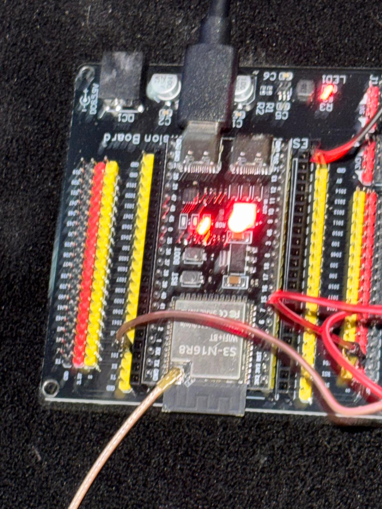
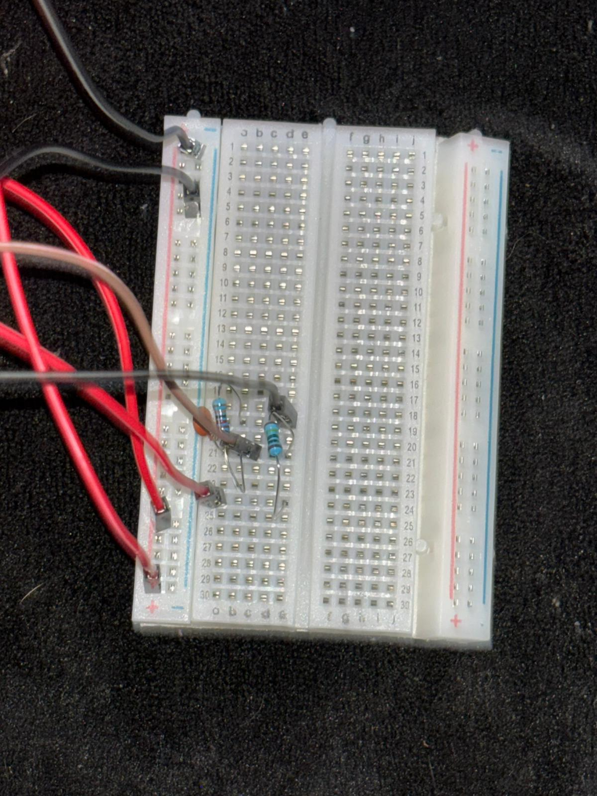
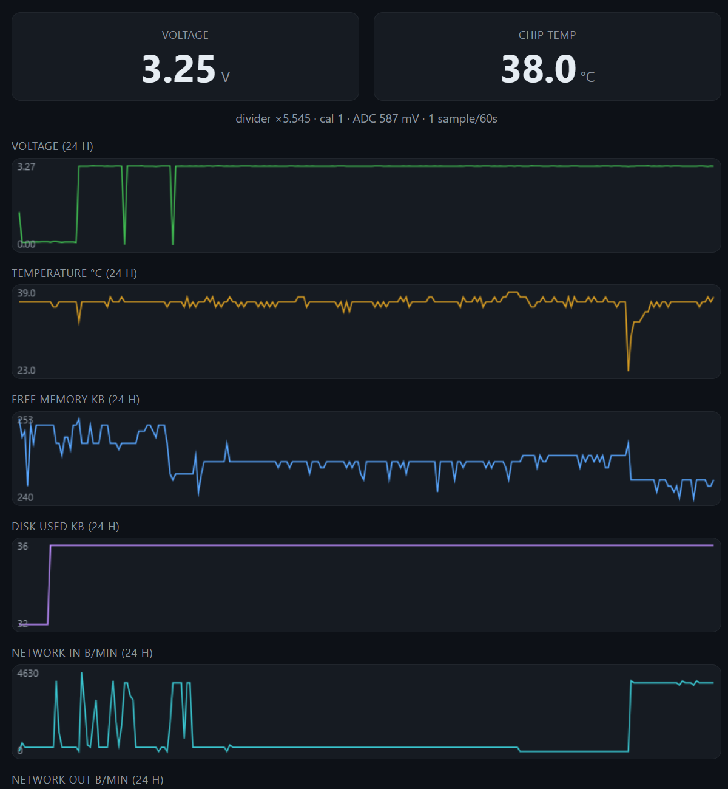
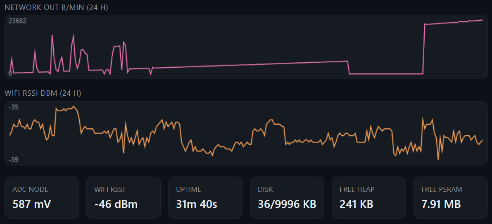

# 2026-06-09 — Stage 1: the ESP32 reads a voltage (first hardware)

Parts finally on the bench. This is the **first real-hardware milestone**
of v1: the ESP32 sensing a voltage through a divider and reporting it.
Everything before today was firmware + docs against simulated ADC
values; today the ADC reads a physical resistor network.

Done in a sibling dev folder (`Claude_Projects\esp32\`, session "ESP32")
since this is Arduino/C++ bring-up rather than the MicroPython firmware
tree in this repo — but it's vroom's Stage-1 work, so it's logged here.

## What got built

A two-resistor voltage divider on a breadboard, feeding one ADC pin on
an ESP32-S3, which serves a live telemetry dashboard over WiFi.



*Overview: the ESP32-S3 board (on a screw-terminal expansion board)
with the external WiFi antenna on its U.FL pigtail, red/black jumpers
out to the breadboard, powered + flashed over USB-C.*



*The module is an **ESP32-S3-N16R8** (silkscreen reads `S3-N16R8
Wi-Fi+BT`) — 16 MB flash, 8 MB PSRAM, dual USB-C. The free-PSRAM tile
on the dashboard (7.91 MB) confirms the R8 PSRAM part. Note this is
**not** the ESP32-WROOM-32U the BOM specced — see "Divergence from the
documented design" below.*

## The voltage divider



Parts (from the "ESP32" session):

| Part | Value | Role |
|---|---|---|
| R1 (top) | **1 MΩ** | Upper leg — from V_source to the ADC tap |
| R2 (bottom) | **220 KΩ** | Lower leg — from the ADC tap to GND |
| C1 | **100 nF** | Across R2 (ADC tap → GND) — sampling reservoir + ripple filter |

**Divider ratio:**

```
ratio = (R1 + R2) / R2 = (1,000,000 + 220,000) / 220,000 = 5.545
V_source = V_adc × 5.545
```

The dashboard's own caption confirms it: **`divider ×5.545`**.

Why these values (and not the BOM's 30 kΩ / 10 kΩ):

- **Low quiescent draw.** Total divider resistance is 1.22 MΩ. At a
  12.6 V resting battery that's `12.6 / 1,220,000 ≈ 10 µA` flowing
  through the divider continuously. The old 30 k/10 k pair would burn
  `12.6 / 40,000 ≈ 315 µA` — 30× more, which matters a lot for a
  thing that sits on a parked battery for weeks. 10 µA is excellent
  for always-on.
- **Headroom without clipping.** The S3 ADC is usable to roughly
  3.1–3.3 V at the pin. At ×5.545 that maps to a source ceiling of
  ~17–18 V — comfortably above the ~14.7 V a car sees with the
  alternator charging, so no clipping. A healthy battery range
  (11.8–14.7 V) lands at 2.13–2.65 V on the ADC, mid-scale.
- **The 100 nF cap is what makes the high-impedance divider usable.**
  The ADC's source impedance here is R1‖R2 ≈ 180 kΩ — far above the
  ~10–100 kΩ the ESP32 sample-and-hold wants. The cap is a local
  charge reservoir: it dumps the instantaneous charge the ADC needs
  on each sample, so accuracy doesn't collapse despite the megaohm
  resistors. It also low-passes alternator ripple. Without it, a
  high-impedance divider + onboard ADC reads erratically.

## What the ESP32 actually reads



Top of the self-served dashboard. Decoding the caption
`divider ×5.545 · cal 1 · ADC 587 mV · 1 sample/60s`:

- **`ADC 587 mV`** — the raw onboard-ADC reading at the tap pin.
- **`×5.545`** — the divider ratio applied in firmware.
- **`587 mV × 5.545 = 3,255 mV ≈ 3.25 V`** — matches the big VOLTAGE
  readout exactly. The math closes; the sensing path is correct.
- **`cal 1`** — calibration factor is unity (uncalibrated). Next step
  is to feed a multimeter-known voltage and set this factor so the
  display tracks the meter, correcting ADC nonlinearity + resistor
  tolerance.
- **`1 sample/60s`** — sampling once a minute, matching the
  `WAKE_INTERVAL_S = 60` cadence the firmware design assumes.

Today's source was ~3.25 V (a bench rail standing in for the eventual
12 V battery feed), so the ADC saw ~587 mV through the divider and
reconstructed 3.25 V. The point of Stage 1 isn't the number — it's that
**divider → ADC → ratio → reported voltage** works end to end.

## The dashboard (served from the ESP32 itself)



The S3 runs its own web server and serves a dark-theme telemetry page —
no Pi involved. On it:

- **Gauges:** Voltage (3.25 V), Chip temp (38.0 °C)
- **24 h charts:** voltage, temperature, free memory, disk used,
  network in/out, WiFi RSSI
- **Stat tiles:** ADC node 587 mV · WiFi RSSI −46 dBm · uptime 31 m 40 s
  · disk 36 / 9996 KB · free heap 241 KB · free PSRAM 7.91 MB

The voltage chart shows a couple of brief dropouts (dev reboots /
reflashes); temperature holds ~38–39 °C; RSSI hovers −35 to −59 dBm.
Everything's stable over the half-hour of uptime.

The S3 serving its own status page covers a chunk of what the Pi
dashboard did, **on the ESP32**. For the in-car always-on build WiFi
would normally stay off to save power, so this is a bench/dev
convenience today — but it shows v1 can have a glanceable status page
without the Pi.

## Divergence from the documented design

Today's bench hardware differs from what `docs/BOM.md` and
`docs/architecture.md` currently describe. The design docs still
reflect the original parts plan; today's build moved to a lower-power,
higher-headroom front end:

| Aspect | Docs (v1 as written) | Built today |
|---|---|---|
| MCU | ESP32-WROOM-32U | **ESP32-S3-N16R8** (16 MB flash / 8 MB PSRAM) |
| ADC | External ADS1115 (16-bit, I²C) | **ESP32-S3 onboard ADC** |
| Divider | 30 kΩ / 10 kΩ (×4) | **1 MΩ / 220 kΩ (×5.545)** |
| Filter cap | 10 µF tantalum | **100 nF** across the low leg |

The 1 MΩ / 220 kΩ divider drops the continuous quiescent draw from
~315 µA to ~10 µA — a meaningful win for a monitor that lives on a
parked battery. The S3's extra RAM + PSRAM is what makes the
self-served dashboard cheap. The onboard ADC replaces the planned
ADS1115; calibration (step 1 below) is what brings it to battery-cutoff
accuracy. `docs/BOM.md` and `docs/architecture.md` will be reconciled
to this front end once calibration confirms the onboard-ADC accuracy.

## What Stage 1 proves / what's next

✅ **Proven today:** physical divider → ESP32 ADC → firmware ratio →
correct reported voltage, sampled on the 60 s cadence, with a live
dashboard for eyeballing it.

Next, in rough order:

1. **Calibrate** (`cal 1` → real factor): feed a multimeter-known
   voltage, set the factor so the display matches the meter.
2. **Real 12 V source:** move off the bench rail to an actual 12 V
   supply / battery through the divider; confirm the reading tracks a
   meter across 11–15 V.
3. **Thresholding → trigger logic:** wire the measured voltage into the
   low-voltage-sustained decision (`LOW_V_TRIGGER` / `LOW_V_SUSTAIN_S`)
   that fires the start sequence — the core of v1.
4. **Deep-sleep power path:** confirm sub-mA average with the divider's
   ~10 µA + the S3's sleep current.

Then Stage 2 is the CC1101 RF replay (already captured + decoded in
Phase 1), and Stage 3 is putting them together into the full
voltage-trigger-and-start loop.

## Stage 2 — 433 MHz transmitter integration (programmed)

The 433 MHz transmitter from the BOM is the **CC1101 sub-GHz module**.
Programmed its integration into the S3 firmware. The build moved into
the vroom repo so it no longer depends on the sibling `esp32/` learning
folder — see the new [`esp32-s3/`](../esp32-s3/) tree.

### Brought the firmware into vroom

Copied the active firmware + supporting files out of the sibling
`Claude_Projects\esp32\` project into `vroom/esp32-s3/` (source only —
not the regenerable `build/` artifacts or the multi-GB toolchain):

```
esp32-s3/
  voltage_monitor/voltage_monitor.ino   the fw (now 1.6)
  voltage_monitor/partitions.csv
  docs/voltage-monitor.md + wiring-breadboard.png + make_wiring.py
  python/voltage_client.py
  README.md                              (new — orients the tree)
```

The MicroPython tree at `esp32/` stays as the design reference + CPython
tests; `esp32-s3/` is the actual flashed Arduino build.

### The CC1101 driver (ported, not libraried)

Wrote a self-contained `cc1101_compustar.h` / `.cpp` — a direct port of
the project's MicroPython `esp32/src/lib/cc1101.py` +
`esp32/src/lib/compustar.py`. No external Arduino CC1101 library; the
register init is the same TI-SmartRF 433.92 MHz async-OOK config, and we
bit-bang GDO0 with the 1WG3R pulse train:

- "0" bit = HIGH 732 µs + LOW 1136 µs
- "1" bit = HIGH 1100 µs + LOW 756 µs
- sync   = HIGH 1476 µs + LOW 1500 µs
- packet = 3 sync + 35 data bits, repeated 8× per press (39 ms guard)

`delayMicroseconds` on the S3 is cycle-accurate; the few µs of WiFi-ISR
jitter is far inside the receiver's ±10–15 % window for these 700–1500 µs
pulses, so interrupts stay enabled (disabling them for the ~70 ms burst
would stall WiFi).

### Firmware integration

In `voltage_monitor.ino`:

- CC1101 on its own SPI bus (FSPI), pins **SCK 18 / MISO 17 / MOSI 16 /
  CS 15 / GDO0 4** — chosen to dodge the ADC pin (GPIO1), strapping pins,
  flash/PSRAM, USB, UART0, the RGB LED, and the disabled display pins.
- `POST /transmit?button=START|LOCK|UNLOCK|TRUNK` renders + transmits.
- Four buttons added to the dashboard (START confirms first), plus an
  RF-status line that reads `armed` / `present, no patterns` / `not
  detected` / `disabled` from a new `rf` field in `/json`.
- Init at boot logs the CC1101 PARTNUM/VERSION if the chip answers.

### Safety — transmit is blocked by default

`/transmit` is guarded at every layer: unknown button → 400, RF disabled
→ 503, **CC1101 absent → 503**, **patterns-not-captured → 409**. The
patterns themselves are FOB-identifying and live in a gitignored
`secrets.h` (template: `secrets.h.example`); the shipped placeholders are
all-zero with `COMPUSTAR_PATTERNS_CAPTURED 0`, so a bench board with no
real captures and/or no wired CC1101 **cannot emit a live packet**.
This also kept the **WiFi credentials out of the public repo** — they
moved from hardcoded `.ino` constants into the same gitignored
`secrets.h`.

### Verified

- **Compiles clean** for the S3:
  `arduino-cli compile --fqbn esp32:esp32:esp32s3:PSRAM=opi,FlashSize=16M`
  → "Sketch uses 1080195 bytes (82 %) of program storage … Global
  variables use 51224 bytes (15 %)." No warnings from the new code.
- Bumped `FW_VERSION` 1.5 → **1.6** so a future OTA flash visibly
  confirms it landed.

### Not yet done (the hands-on bring-up)

- **CC1101 not physically wired** — the board is still the bare voltage
  divider. Wiring per the table above is the next bench step.
- **Not flashed** — fw 1.6 compiles but board #1 still runs 1.5. Flash
  via OTA (`/update`) when ready; RF stays inert (logs "CC1101 NOT
  detected") until the module is wired.
- **No real captured patterns** — `secrets.h` has placeholders; RF stays
  blocked. The SDR capture → `capture-to-secrets.py` step populates the
  real 35-bit patterns.
- **On-air verification pending** — once wired + patterns loaded, confirm
  the transmitted burst matches the genuine FOB with an SDR capture
  (`sdr/scripts/diff-captures.py`) before any car test, then first-trigger
  per `docs/15-first-trigger.md` (hood open).

Board reference: this is **board #1** (MAC `44:1B:F6:81:F2:50`), the
esp32-volt unit. Board #2 is a separate project.
