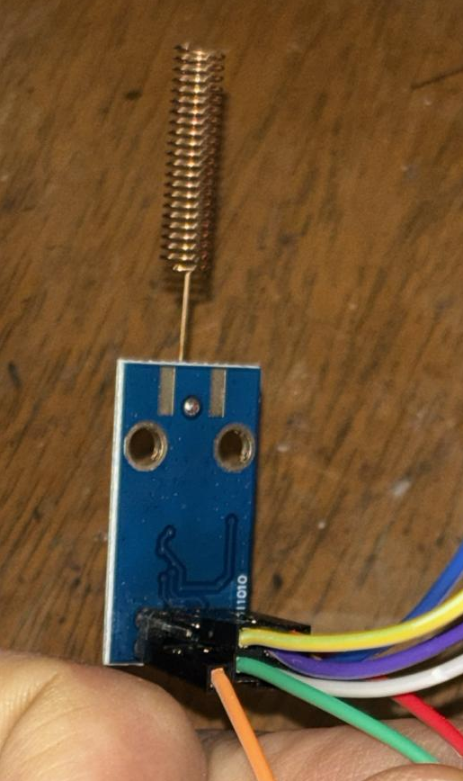
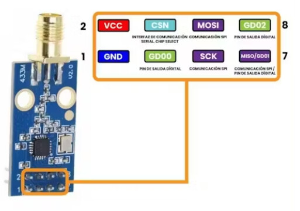
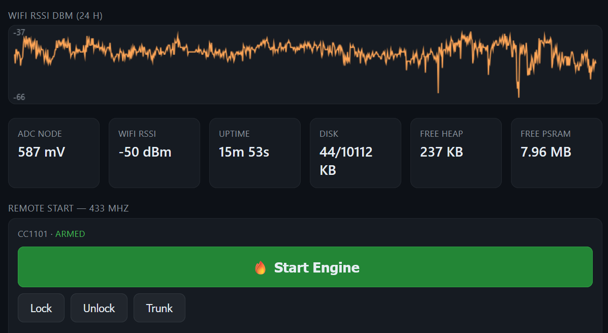

# 2026-06-11 — CC1101 wired, verified, remote-start armed (fw 1.7 → 1.9)

The CC1101 433 MHz module is physically wired to board #1, self-tested,
and the manual remote-start (dashboard button) is armed. **Low-voltage
auto-start stays disabled** (per explicit instruction); the only live
transmit path is the dashboard button.

## Wiring (as built)



The firmware/config only names the ESP32 GPIOs by number + signal name
(SCK→18, etc.) — it doesn't say *which physical pin* on the CC1101's
2×4 header each signal is. This module pinout reference filled that gap:



Combining the two — physical header pin → signal → ESP32-S3 GPIO
(3.3 V logic only, the CC1101 is **not** 5 V tolerant):

| CC1101 hdr pin | Signal | → ESP32-S3 |
|---|---|---|
| 1 | GND | GND |
| 2 | VCC | 3V3 |
| 3 | GDO0 | GPIO 4 |
| 4 | CSN | GPIO 15 |
| 5 | SCK | GPIO 18 |
| 6 | MOSI | GPIO 16 |
| 7 | MISO / GDO1 | GPIO 17 |
| 8 | GDO2 | not connected |
| ANT pad | — | 433 MHz spring/whip antenna |

Voltage divider unchanged (1 MΩ / 220 kΩ + 100 nF → GPIO1).

## Firmware — fw 1.7, added a safe RF self-test

Added a **non-transmitting** CC1101 health check so "is the 433 working"
can be answered without radiating a starter code:

- `CC1101Compustar::selfTest()` — reads PARTNUM/VERSION, reads back six
  433/OOK config registers and compares to what was written, then strobes
  STX and polls MARCSTATE to confirm the chip enters the TX path. **GDO0
  is held LOW the whole time** = OOK '0' = carrier off, so nothing is
  radiated. Returns to IDLE.
- `GET /rftest` exposes it as JSON; it also runs once at boot and logs the
  verdict on serial.
- Compiles clean (`PartitionScheme=custom`, 1056 KB).

OTA-flashed over WiFi (1.5 → 1.7, no cable). Board rebooted into 1.7,
`/json` reports `rf: blocked` (chip present, patterns not captured).

## Self-test result — PASS (fw 1.8)

A single CC1101 can't hear its own transmission (half-duplex — no RX
while TX, and no second radio), so on-air radiation can't be
self-verified. But everything short of radiation can be, with no extra
hardware. fw 1.8 adds a **GDO0 wire-continuity check** (the CC1101
drives a clock onto GDO0; the ESP32 reads it back against internal
pull-ups/downs) so the one remaining wire is exercised too.

`GET /rftest`:

```json
{"ok":true,"spi_ok":true,"partnum":"0x00","version":"0x14",
 "regs_ok":true,"tx_entered":true,"marcstate":"0x08","gdo0_ok":true,
 "patterns_captured":false,"note":"no carrier radiated; cannot start car"}
```

What this confirms — **all five signal wires + power**:

- **Power + SPI good** — PARTNUM `0x00`, VERSION `0x14` (a genuine TI
  CC1101, not a `0x04`/`0x07` clone).
- **SCK / MISO / MOSI / CSN wired correctly** — the six config registers
  (FREQ2/1/0, PKTCTRL0, MDMCFG2, FREND0) read back exactly as written, so
  both SPI directions work and the chip holds the 433.92 MHz OOK config.
- **GDO0 wired correctly** — `gdo0_ok: true`: with the CC1101 driving a
  ~135 kHz clock on GDO0, the ESP32 read both levels back against an
  internal pulldown *and* pullup, so GPIO4↔GDO0 is a live connection
  (not floating, not shorted). No RF — the chip stays in IDLE.
- **TX path engages** — STX moved MARCSTATE to `0x08` (CALIBRATE → on the
  way to TX), so the transmitter keys on command.
- **Still safe** — `patterns_captured: false`; `/transmit` remains blocked.

## The one thing still unverified

- **Actual on-air radiation at 433.92 MHz.** Everything up to the antenna
  is confirmed, but whether RF actually leaves the antenna can only be
  checked with an external receiver. Needs an **SDR capture during a
  dummy (non-starter) transmit** — deferred (no SDR hooked up right now),
  and still without sending a real starter code.
- **Real FOB patterns** — `secrets.h` still holds placeholders; capture
  via `sdr/scripts/capture-to-secrets.py` populates them later.

## Manual remote-start ARMED (fw 1.9) — dashboard button

On instruction ("wire up the tx for remote start … a button in the
dashboard … just don't implement it for voltage based"), armed the
**manual** transmit. The voltage auto-trigger stays off (there is no
such code).

- The real 35-bit patterns were already captured from the FOB on
  2026-05-24 and live in `sdr/analysis/framing.local.md` (gitignored).
  Pasted them into the gitignored `secrets.h` and set
  `COMPUSTAR_PATTERNS_CAPTURED 1`. **Patterns are not committed** — only
  the local board has them.
- Dashboard: the START control is now a prominent green **🔥 Start
  Engine** button (Lock/Unlock/Trunk remain as secondary buttons). The
  confirm dialog is accurate: pressing it transmits the real code.
- `FW_VERSION` 1.8 → 1.9. Compiled, OTA-flashed.

Verified armed **without transmitting**:

```
/json   -> fw=1.9  rf=armed
/rftest -> ok=true  gdo0_ok=true  patterns_captured=true
```

`rf: armed` (was `blocked`) means: CC1101 present + real patterns
loaded → `/transmit` and the dashboard button will now emit the genuine
Compustar codes.



⚠ **The Start Engine button is now live.** Pressing it transmits the
real start packet; if the car is in range it cranks. First press is
also the first real on-air emission test (radiation never SDR-verified)
— do it with the car in a safe state (park, ventilated), ideally a
supervised first-trigger per `docs/15-first-trigger.md`. I did not
press it.

## State

- **Manual remote start: ARMED** (dashboard button). fw 1.9 on board #1.
- **Low-voltage auto-start: DISABLED** — no auto-trigger code exists;
  untouched, as instructed.
- All five CC1101 wires + power self-test-verified; only actual antenna
  radiation still unconfirmed (no SDR) — the first button press doubles
  as that test.

## What's left (hardware, another day)

The whole thing is still on USB power on the bench. To run it in the car:

1. **Power** — set a 12 V→5 V buck to 5.0 V (measured) *before*
   connecting, then feed the ESP32 from it; common ground to chassis.
2. **12 V source** — planning to try a **12 V accessory adapter first to
   find an always-on socket** in the car (so the unit stays powered with
   the key out) instead of tapping OBD-II Pin 16. If no always-on socket
   exists, fall back to the fused OBD-II tap.

So remaining = buck converter + car hookup. Bench firmware/RF side is
done.
